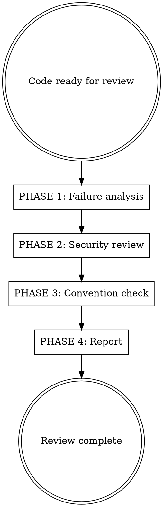

# Code Quality Reviewer

## Overview

Reviews code in `modules/core/` for failure modes, security issues, and GENis project convention compliance. This is a forensic genetic platform used in real judicial cases — correctness is critical.

**Applies to:** Any code in `modules/core/`, whether migrated from legacy or written from scratch.

## When to Use

- After `/migration-fidelity-reviewer` (for migrated code)
- After writing new features in `modules/core/`
- Before committing significant changes

## Process



---

## PHASE 1: Failure Analysis

Analyze the code for failure modes. Read the actual code, not just diffs.

### Execution errors

- **Unhandled exceptions**: Code paths that can throw without being caught?
- **Future composition errors**: `.map` vs `.flatMap` confusion? Missing `.recover`?
- **DBIO composition errors**: Short-circuit logic correct in fold/flatMap chains?
- **Silent failures**: Operations that fail quietly (return empty instead of error)?

### Resource management

- **Resource leaks**: DB connections not closed? Slick `Database.forConfig` without shutdown?
- **Connection pool misuse**: Creating `Database.forConfig(...)` instead of injecting shared `Database`?
- **Deadlocks**: Nested `Await.result` inside Future? Blocking on same execution context?

### Data integrity

- **Constraint violations**: Are DB constraints (unique, foreign key) handled?
- **Partial writes**: Can a failure leave the DB inconsistent? (Check transaction boundaries)
- **Data loss paths**: Code paths where data could be silently dropped?
- **Type mismatches**: Numeric precision (Long vs Int vs BigDecimal), string encoding, date/timezone

**Output:** Categorized list of potential failures.

---

## PHASE 2: Security Review

Run through the checklist in `.claude/rules/security-checklist.md`. It covers:

1. **Auth & authorization** — endpoints covered by filters, permissions preserved, no accidental bypass
2. **Sensitive data** — generic error messages (not `e.getMessage`), no forensic data in logs, minimal responses
3. **Audit trail** — PEO/filters still cover migrated endpoints, logical deletes for forensic data
4. **Input validation** — `validate[T]` at controllers, parameterized Slick queries
5. **Error handling** — exceptions logged server-side, user-friendly Spanish messages to client

**Output:** Security findings with severity, referencing specific checklist items.

---

## PHASE 3: Convention & Quality Check

Verify adherence to GENis project conventions.

### Architecture
- [ ] Repository trait exposes only `Future[T]` — no DBIO/Slick types leak
- [ ] Repository impl uses private `DBIO` methods composed with `db.run(action.transactionally)`
- [ ] Service is thin: delegates to repo + cache + side-effects
- [ ] Cache invalidated AFTER commit (in `.map` of successful Future), not inside transaction
- [ ] Package structure mirrors legacy (`user/`, `security/`, `kits/`, `motive/`, etc.)

### Dependency injection
- [ ] Repositories receive `Database` via `@Inject()(db: Database)`, not `Database.forConfig(...)`
- [ ] Controllers never inject infrastructure types (`LDAPConnectionPool`, `Database`, MongoDB clients) directly
- [ ] Infrastructure wrapped in project-owned trait + impl, bound in domain Guice module
- [ ] Guice module registered in `application.conf` under `play.modules.enabled`

### Code style
- [ ] Scala 3 syntax: no braces for single-expression methods, `enum`, `given`/`using`
- [ ] Spanish for domain terms matching legacy, English for generic concepts
- [ ] Routes use `/api/v2/` prefix

### Quality
- [ ] No over-engineering beyond what's needed
- [ ] No unnecessary abstractions
- [ ] No dead code or unused imports
- [ ] Logging appropriate (not excessive, not missing for error paths)

**Output:** Convention compliance checklist with pass/fail per item.

---

## PHASE 4: Report

### Report structure

```
## Quality Review: [Domain/Feature Name]

### Summary
- Files reviewed: N
- Critical issues: N
- Important issues: N
- Suggestions: N

### Critical Issues (MUST fix before commit)
[Security vulnerabilities, data loss risks, resource leaks]

### Important Issues (SHOULD fix)
[Convention violations, potential failure modes, missing validation]

### Suggestions (NICE to have)
[Code quality improvements, style fixes]

### Convention Compliance
[Checklist from Phase 3]
```

### Severity criteria

| Severity | Definition | Examples |
|---|---|---|
| **CRITICAL** | Could produce incorrect results, lose data, or create security holes | SQL injection, resource leak, unhandled data loss path |
| **IMPORTANT** | Could cause operational issues or violates conventions | Missing DI pattern, cache inside transaction, wrong package |
| **SUGGESTION** | Improves quality without affecting behavior | Idiomatic Scala 3, better variable names, cleaner imports |
