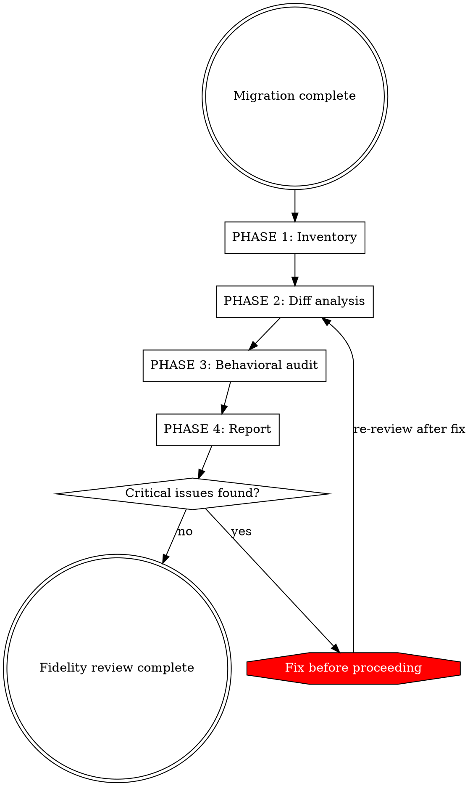

# Migration Fidelity Reviewer

## Overview

Behavioral fidelity review for GENis migrations. GENis is a forensic genetic platform used in real judicial cases — a behavioral divergence can affect criminal investigations.

**Core principle:** The migrated code must be *behaviorally equivalent* to legacy unless a deviation is explicitly justified and approved. When in doubt, match legacy behavior exactly.

## When to Use

- After completing migration of a feature from `app/` to `modules/core/`
- Before running `/code-quality-reviewer`
- Before writing tests or committing

## Process



---

## PHASE 1: Inventory

Map every legacy file to its migrated counterpart. Identify gaps.

**Actions:**
1. List all legacy files in the domain being reviewed (`app/<domain>/`)
2. List all migrated files (`modules/core/app/<domain>/`)
3. Build a mapping table:

| Legacy file | Migrated file | Status |
|---|---|---|
| `app/X/Repo.scala` | `modules/core/app/X/RepoImpl.scala` | Migrated |
| `app/X/Helper.scala` | — | Missing / Intentionally omitted |

4. For each "Missing" entry: verify it's intentionally omitted or flag as gap
5. Check for **new files** with no legacy counterpart — these need justification
6. Verify Guice module registration in `application.conf`
7. Verify routes in `modules/core/conf/routes` with `/api/v2/` prefix

**Output:** Complete file inventory with status.

---

## PHASE 2: Diff Analysis — Classify Every Change

For each legacy/migrated file pair, perform a **line-by-line conceptual diff**. Classify every difference:

### Change Categories

**SYNTACTIC** — Unavoidable syntax differences. Mechanical, low-risk.
- Scala 2 → Scala 3 syntax (braces, enums, given/using, extension methods)
- Play 2.3 → Play 3.0 API changes
- javax.inject → jakarta.inject
- Import path changes

**STRUCTURAL** — Forced by architectural differences. Inevitable but require review.
- Slick 2.1 → 3.5 (Session → DBIO, runInTransactionAsync → db.run(action.transactionally))
- ReactiveMongo → MongoDB sync driver
- Play-slick → pure Slick
- DI wiring differences

**RECOMMENDED** — Improvements not required by the migration. Optional, require justification.
- Better error handling, idiomatic Scala 3 patterns, bug fixes, simplifications

### Audit Rules

- **Every RECOMMENDED change is a risk.** If it changes observable behavior, it's CRITICAL, not "recommended."
- **STRUCTURAL changes must preserve semantics.** HOW changes, WHAT must be identical.
- **Missing logic is a defect.** If legacy has a code path the migrated version doesn't, it's a bug until proven otherwise.
- **API response format changes are behavioral.** `JsError.toFlatJson` → `JsError.toJson` produces different JSON. Classify as IMPORTANT if clients may depend on the format.
- **Field mapping changes matter.** Mapping more/fewer fields than legacy changes the data returned.

**Output:** Table of all changes with classification and risk assessment.

---

## PHASE 3: Behavioral Audit

For each public method in the migrated code, verify behavioral equivalence with legacy.

### Method-by-method comparison

1. **Inputs**: Same parameter types/semantics? Any implicit parameters lost?
2. **Outputs**: Same return type? Same shape of data? Same error types?
3. **Side effects**: Same DB writes? Same cache operations? Same external calls?
4. **Error handling**: Same exceptions caught? Same error messages? Same recovery?
5. **Edge cases**: Empty inputs? null/None? DB constraint violations? Concurrent access?
6. **Query equivalence**: Equivalent SQL? Watch for:
   - Missing filters (especially `deleted === false` or `freeText === false`)
   - Different sort orders, missing joins, changed join types

### Transaction boundaries

- Legacy `runInTransactionAsync { implicit session => ... }` wraps what?
- Migrated `db.run(action.transactionally)` wraps the same operations?
- Operations that moved in/out of the transaction scope?

### Cache behavior

- Cache keys identical?
- Cache invalidation timing correct? (MUST be after commit, not inside transaction)
- Cache population logic equivalent?

### Concurrency semantics

- Legacy: `Future { DB.withSession { ... } }` — blocking DB in Future
- Migrated: `db.run(...)` — non-blocking DBIO
- Race conditions introduced by changed execution model?

**Output:** Per-method behavioral equivalence verdict with specific findings.

---

## PHASE 4: Report

### Report structure

```
## Fidelity Review: [Domain Name]

### Summary
- Files reviewed: N legacy → N migrated
- Changes classified: N syntactic, N structural, N recommended
- Behavioral equivalence: [PASS / ISSUES FOUND]

### Critical Issues (behavioral divergences that MUST be fixed)
[Issues that change observable behavior or introduce data loss risk]

### Important Issues (SHOULD review)
[Subtle differences that could cause issues under specific conditions]

### Change Classification Detail
[Full table from Phase 2]

### Behavioral Equivalence Detail
[Per-method verdicts from Phase 3]
```

### Severity criteria

| Severity | Definition | Examples |
|---|---|---|
| **CRITICAL** | Changes observable behavior, could affect forensic results | Missing filter, wrong transaction boundary, lost error path |
| **IMPORTANT** | Could cause issues under specific conditions | Cache timing, changed concurrency semantics |
| **NOTE** | Documented, accepted divergence | JsError format change, cache-after-commit fix |

## Red Flags — STOP and Investigate

If you encounter any of these, they are likely CRITICAL:

- A query filter present in legacy but absent in migrated code
- A `try/catch` or `.recover` in legacy with no equivalent in migrated code
- A transaction boundary that is narrower in migrated code than in legacy
- A conditional branch in legacy that doesn't exist in migrated code
- An `Either.Left` error case in legacy not handled in migrated code
- Return type changed from `Either[String, T]` to `Future[T]` (error path lost)
- Legacy method exists but has no migrated counterpart

## What This Skill Does NOT Do

- Does not review code quality or conventions (use `/code-quality-reviewer`)
- Does not write or run tests (use `/migration-test-writer`)
- Does not modify code (only reviews and reports)
