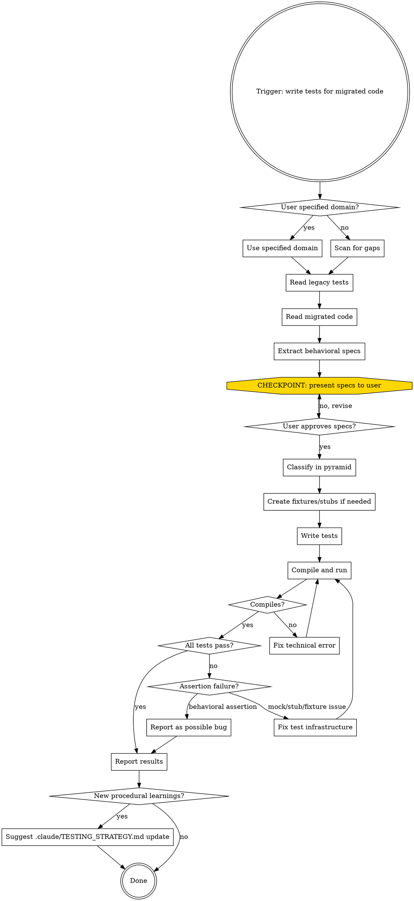

# Migration Test Writer

## Overview

Structured process for writing tests for code migrated from GENis legacy (Scala 2.11/Play 2.3) to the new stack (Scala 3.3.1/Play 3.0.6). Extracts behavioral specs from broken legacy tests, validates with the user, then writes new tests following .claude/TESTING_STRATEGY.md.

**Core principle:** Legacy tests are a spec source, not a template. Extract WHAT they test, ignore HOW they test it.

## When to Use

- User asks to write tests for migrated code in `modules/core/`
- User asks what migrated modules lack test coverage
- After migrating functionality from `app/` to `modules/core/`

## Process Flow



## Phase 1: SCOPE

**If user specifies domain** (e.g., "write tests for security/AuthService"):
- Find legacy tests: `test/<domain>/`
- Find migrated code: `modules/core/app/<domain>/`

**If user doesn't specify** (gap detection mode):
- List all packages in `modules/core/app/`
- List all test directories in `modules/core/test/unit/` and `modules/core/test/integration/`
- Report which packages have no corresponding tests
- Ask user which to tackle first

## Phase 2: EXTRACT

Read each legacy test file. For every `"must"` / `"should"` / `"in"` block, extract:

1. **Behavior description** — the string label (e.g., "authenticate a user")
2. **Test type** — unit (mocks deps), integration (needs app/infra)
3. **Inputs and preconditions** — what setup is needed
4. **Expected outputs** — what the assertion checks
5. **Edge cases** — error paths, boundary conditions
6. **Fixtures referenced** — what data from `Stubs.scala` is used

**IGNORE completely:** `PdgSpec`, `FakeApplication`, `OneAppPerSuite`, `Iteratee`/`Enumeratee`, `org.scalatest.mock.MockitoSugar`, `org.mockito.Matchers`, `Execution.Implicits.defaultContext`. These are dead APIs.

**MANDATORY: Read the FULL migrated code** in `modules/core/app/<domain>/`. For every public method, check:
- Is it covered by a legacy test? If not, add a spec.
- Did the signature change? Note the difference.
- Are there new branches/validations? Add specs for each.
- For enums/ADTs: add a spec for EVERY variant (e.g., test all UserStatus values, not just one).

Output format:
```
## Extracted Specs: <ClassName>

### From legacy tests:
1. [UNIT] authenticate valid user → returns Some(FullUser)
2. [UNIT] reject invalid OTP → returns None
3. [UNIT] decrypt encrypted request URI → returns decrypted path
...

### From migrated code (not in legacy tests):
4. [UNIT] handle inactive user status → returns None
5. [CONTROLLER] POST /api/v2/login with malformed JSON → 400
...

### Fixtures needed:
- LdapUser variants (active, blocked, pending) — check UserFixtures
- AuthenticatedPair — check SecurityFixtures
- TotpToken — check SecurityFixtures
```

## Phase 3: CHECKPOINT

**MANDATORY.** Present the extracted specs to the user before writing any test code.

Ask:
- Are any specs no longer relevant in the migrated version?
- Are there behaviors missing that should be tested?
- Any specs that should change tier (e.g., unit → integration)?

**Do NOT skip this step.** Do NOT write tests before user approval.

## Phase 4: WRITE

### Step 4a: Classify each spec

Assign each approved spec to a pyramid tier:

| Tier | Criteria | Location | Naming |
|------|----------|----------|--------|
| Unit | No I/O, direct instantiation, mocks for stateless deps | `test/unit/<domain>/` | `*Test.scala` |
| Controller | Needs Play app, tests routing/status/content-type | `test/integration/controllers/` | `*Test.scala` |
| Infra integration | Needs Docker (Postgres/LDAP/Mongo) | `test/integration/<domain>/` | `*IntegrationTest.scala` |

### Step 4b: Create fixtures and stubs

Before writing tests, check what exists in `modules/core/test/fixtures/` and `modules/core/test/<domain>/`.

**Fixtures** (`test/fixtures/<Domain>Fixtures.scala`):
- Domain data objects (users, tokens, profiles)
- In-memory stubs for stateful deps (`StubCacheService`, etc.)
- Follow existing pattern: `object XxxFixtures { val yyy = ... }`

**Guice stubs** (`test/<domain>/TestXxxModule.scala`):
- Injectable `@Singleton class StubXxxRepository @Inject()()(using ec: ExecutionContext)`
- Only for controller/integration tests that use `GuiceApplicationBuilder`
- Follow pattern in `test/security/TestSecurityModule.scala`

### Step 4c: Write tests

**MUST read .claude/TESTING_STRATEGY.md and follow it.** Key rules:

**Imports (use these, never legacy):**
```scala
import org.scalatest.matchers.must.Matchers
import org.scalatest.wordspec.AnyWordSpec
import org.scalatestplus.mockito.MockitoSugar      // for unit tests
import org.mockito.ArgumentMatchers.any             // NOT org.mockito.Matchers
import org.scalatestplus.play.*                     // for controller tests
import org.scalatestplus.play.guice.GuiceOneAppPerTest
```

**Mock strategy (not interchangeable!):**

| Dependency type | Mechanism | Where defined |
|-----------------|-----------|---------------|
| Stateless (repos, services returning fixed values) | `mock[T]` with Mockito | Inline in test |
| Stateful (cache, stores with get/set) | In-memory stub class | `test/fixtures/` |
| Complex behavior (identity decrypt, custom logic) | Small stub class | Inline in test file (justified) |
| In controller test with Guice | Module override `bind[X].to[StubX]` | `test/<domain>/` |

**When to use a stub class instead of Mockito:** When the mock behavior needs complex logic (e.g., identity transform on decrypt, state tracking across calls), a small inline stub class is acceptable. Use Mockito for simple `when(...).thenReturn(...)` patterns.

**Controller test pattern:**
```scala
class XxxControllerTest extends PlaySpec with GuiceOneAppPerTest {
  override def fakeApplication(): Application =
    GuiceApplicationBuilder()
      .disable[ProductionModule]
      .overrides(bind[Dep].to[StubDep])
      .configure("play.http.secret.key" -> "test-secret-key-...")
      .build()

  "endpoint" must {
    "return expected status" in {
      val request = FakeRequest(POST, "/api/v2/endpoint").withBody(Json.obj(...))
      val result = route(app, request).get    // NOT new Controller(mock).method()
      status(result) mustBe OK
    }
  }
}
```

**Scala 3 syntax — always use:**
- `using`/`given` (not `implicit`)
- `?` wildcard (not `_` in type position)
- Colon-style `class Foo extends Bar:` where appropriate
- `enum` for ADTs

**Exhaustiveness — every spec MUST have:**
- Happy path
- Invalid/malformed inputs
- Edge cases (empty, null, boundary values)
- Error paths (exceptions, failed futures)
- For enums/ADTs: test EVERY variant (all UserStatus values, not just one)
- For controllers: relevant HTTP status codes (200, 400, 401, 403, 404, 415)
- For stateful services: interaction between operations
- For methods accepting `RequestHeader`: use Play's `FakeRequest` (not custom stubs)

## Phase 5: VERIFY

Run: `sbt "project core" "testOnly *<TestClass>"`

**Diagnosis flowchart:**

| Symptom | Cause | Action |
|---------|-------|--------|
| Doesn't compile | Wrong imports, missing types, syntax error | Fix the test |
| `NullPointerException` in setup | Mock/stub not configured | Fix mock/stub |
| `ClassCastException` | Wrong fixture type | Fix fixture |
| Assertion fails: expected X got Y | **Possible bug in migrated code** | **Do NOT change assertion.** Report to user |
| Timeout | Async issue, missing ExecutionContext | Fix test infrastructure |

**Iterate** until all tests either pass or fail only on behavioral assertions.

## Phase 6: REPORT

Present to user:

```
## Test Results: <Domain>

### Files created:
- test/unit/<domain>/<Class>Test.scala
- test/fixtures/<Domain>Fixtures.scala (new/updated)
- test/<domain>/Test<Domain>Module.scala (if needed)

### Coverage:
- [x] Spec 1: authenticate valid user (PASS)
- [x] Spec 2: reject invalid OTP (PASS)
- [ ] Spec 3: handle concurrent requests (FAIL - possible bug)
  → Expected: thread-safe cache update
  → Actual: race condition in AuthServiceImpl:42

### Specs from checkpoint not covered:
- (none, or list with reason)
```

## Phase 7: LEARNING REVIEW

After reporting results, review the session for **procedural learnings** — patterns,
conventions, or pitfalls discovered during test writing that would be useful for
future test sessions.

**What qualifies as a procedural learning:**
- A technical pitfall with a non-obvious root cause and a reusable fix
  (e.g., library A's implicit shadows library B's operator)
- A convention decision that should apply to all future tests
  (e.g., integration tests must be self-contained)
- A new infrastructure pattern that future tests should follow
  (e.g., shared trait for DB connection, cleanup strategy)

**What does NOT qualify:**
- One-off fixes specific to a single test file
- Known issues already documented in .claude/TESTING_STRATEGY.md
- Bugs found in production code (those belong in issue tracking)

**If there are learnings**, suggest to the user:

```
### Aprendizajes procedurales de esta sesion:

1. [description of learning]
   → Sugiero agregar a .claude/TESTING_STRATEGY.md en la seccion [X]

2. [description of learning]
   → Sugiero agregar al checklist de [tipo de test]

¿Queres que actualice .claude/TESTING_STRATEGY.md con estos aprendizajes?
```

**Do NOT update .claude/TESTING_STRATEGY.md without user approval.** Present the learnings
and let the user decide what and where to document.

If there are no new learnings, simply skip this phase.

## Common Mistakes

| Mistake | Correct approach |
|---------|-----------------|
| Copy legacy test structure and "update" imports | Extract specs, write fresh tests from scratch |
| Use `PdgSpec` or `FakeApplication` | `AnyWordSpec with Matchers` for unit, `PlaySpec with GuiceOneAppPerTest` for controller |
| Put all stubs inline in the test file | Stateful stubs → `test/fixtures/`, Guice stubs → `test/<domain>/` |
| Use `new Controller(mock).method().apply(req)` | Use `route(app, request).get` for controller tests |
| Write only happy path tests | Each spec needs happy path + error paths + edge cases |
| Skip the checkpoint | ALWAYS present specs to user before writing tests |
| Modify failing assertion to make test pass | Report behavioral failures as possible bugs |
| Assume API without reading code | Read the actual migrated code in `modules/core/app/` before writing tests |
| Use `org.scalatest.mock.MockitoSugar` | Use `org.scalatestplus.mockito.MockitoSugar` |
| Use `implicit` in Scala 3 code | Use `using`/`given` |
| Claim "no Mockito dependency" without checking build.sbt | `build.sbt` includes `scalatestplus mockito-5-12` — use it |
| Test only one variant of an enum (e.g., only `blocked`) | Test ALL variants (`active`, `blocked`, `pending`, etc.) |
| Create custom `StubRequestHeader` class | Use `FakeRequest` from Play test — it works for unit tests too |
| Skip reading migrated code, rely only on legacy tests | MUST read migrated code — it may have new methods, changed signatures, new validation |
| Mock the method the code *calls* instead of the one it *should call* | Mock the expected contract, not the current implementation — otherwise the test passes even when the code calls the wrong method (e.g., mocking `repo.addCategory` for a test of `updateCategory` hides the bug) |
